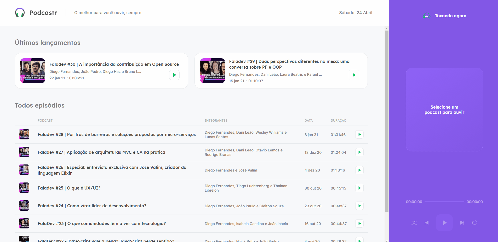

<h1 align="center">
   
</h1>
 

  <a href="#-projeto">Project</a>&nbsp;&nbsp;&nbsp;|&nbsp;&nbsp;&nbsp;
  <a href="#-tecnologias">Technologies</a>&nbsp;&nbsp;&nbsp;|&nbsp;&nbsp;&nbsp;
  <a href="#-usage">Usage</a>&nbsp;&nbsp;&nbsp;|&nbsp;&nbsp;&nbsp;
  <a href="#-participants">Participants</a>

 

## 💻 Project

🔊 Podcastr was an app made with Next JS. The application is a dashboard to play podcasts. It was developed during @Rocketseat NLW#05.. 💜

    

## 🚀 Technologies

This project was developed with the following technologies:

- [React](https://reactjs.org/)
- [Next JS](https://nextjs.org/)
- [Typescript](https://www.typescriptlang.org/)

## 💻 Usage

 ### Mobile App
  
    $ yarn to install the dependencies.
    
    $ yarn server to initiate the json-server

    $ yarn dev
    

## 👥 Participants

[Samuel Formigheri](https://github.com/SamuelFormigheri)